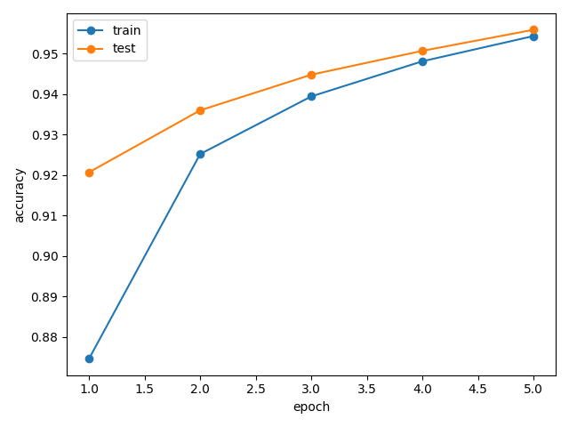
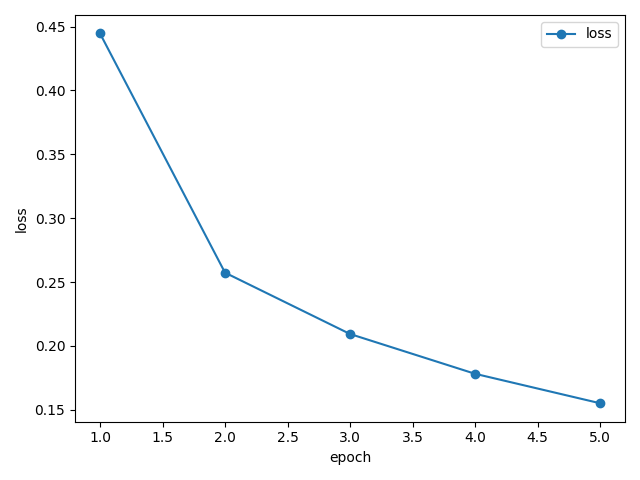

# Hybrid Python/C MNIST CNN

Minimal CPU-only MNIST digit classifier. Python trains the model with PyTorch tensors,
autograd, Adam, and a `ctypes` call into pure C for convolution forward. Final
inference runs in pure C.

## Architecture

```text
1x28x28 input
-> C convolution: 8 filters, 3x3, valid, stride 1, no padding
-> 8x26x26
-> ReLU
-> 2x2 MaxPool
-> 8x13x13
-> Flatten: 13*13*8 = 1352
-> Linear: 1352 -> 10
-> Softmax for prediction
```

No built-in convolution, pretrained model, or external ML runtime is used.

## Python/C Bridge

`train.py` loads `libconv2d.so` or `conv2d.dll` with `ctypes`. The custom
`torch.autograd.Function` calls `conv2d_forward` in C for forward convolution.
Its backward pass is written manually in Python.

## Run

```sh
make lib
make train
make export
make infer
./infer
```

On Windows MinGW:

```sh
mingw32-make lib
mingw32-make train
mingw32-make export
mingw32-make infer
infer.exe
```

## Expected Outputs

- `model_weights.pth`
- `training_log.txt`
- `accuracy_plot.png`
- `loss_plot.png`
- `samples.bin`
- `python_predictions.txt`
- `weights.bin`
- `inference_log.txt`

Training prints epoch loss, train accuracy, and test accuracy. The model is
expected to exceed 90% MNIST test accuracy, and typically exceeds 95% after 5 epochs.

## Binary Weight Layout

`weights.bin` is raw little-endian `float32` values in this order:

1. convolution kernels: `8 * 3 * 3 = 72`
2. convolution bias: `8`
3. linear weights: `10 * 1352 = 13520`
4. linear bias: `10`

`samples.bin` contains exactly 10 records:

```text
int32 sample_index
int32 python_prediction
int32 true_label
float32 image[1*28*28]
```

## Screenshots

- Accuracy plot: `accuracy_plot.png`
- Loss plot: `loss_plot.png`
- Training and inference logs: `logs (2).png`, `logs (3).png`, `logs (1).png`
- Five displayed test images: shown by `train.py`





.png)

.png)

.png)
